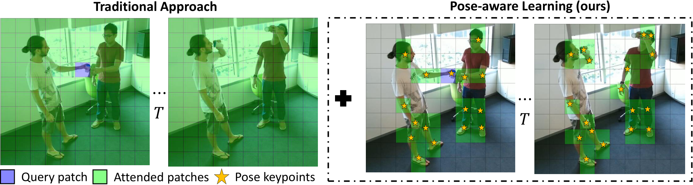

# Seeing the Pose in the Pixels: Learning Pose-Aware Representations in Vision Transformers



This is the code for the paper **Seeing the Pose in the Pixels: Learning Pose-Aware Representations in Vision Transformers**, by Dominick Reilly, Aman Chadha, and Srijan Das. we introduce two strategies for learning pose-aware representations in ViTs. The first method, called Pose-aware Attention Block (PAAB), is a plug-and-play ViT block that performs localized attention on pose regions within videos. The second method, dubbed Pose-Aware Auxiliary Task (PAAT), presents an auxiliary pose prediction task optimized jointly with the primary ViT task.

## Installation
This repository is built on top of [TimeSformer](https://github.com/facebookresearch/TimeSformer) and follows a similar installation.

First, create a conda virtual environment and activate it:
```
conda create -n poseawarevt python=3.7 -y
source activate poseawarevt
```

Then, install the following packages:

- torchvision: `pip install torchvision` or `conda install torchvision -c pytorch`
- [fvcore](https://github.com/facebookresearch/fvcore/): `pip install 'git+https://github.com/facebookresearch/fvcore'`
- simplejson: `pip install simplejson`
- einops: `pip install einops`
- timm: `pip install timm`
- PyAV: `conda install av -c conda-forge`
- psutil: `pip install psutil`
- scikit-learn: `pip install scikit-learn`
- OpenCV: `pip install opencv-python`
- tensorboard: `pip install tensorboard`

Lastly, build the codebase by running:
```
git clone https://github.com/facebookresearch/PoseAwareVT
cd PoseAwareVT
python setup.py build develop
```

## Usage
Coming soon!

## Data preparation
We make use of the following action recognition datasets for evaluation: [Toyota Smarthome](https://project.inria.fr/toyotasmarthome/), [NTU RGB+D](https://rose1.ntu.edu.sg/dataset/actionRecognition/), and [Northwestern-UCLA](https://wangjiangb.github.io/my_data.html). Please download the datasets from their respective sources and structure their directories in the following formats.

### Smarthome
```
├── Smarthome
    ├── mp4
        ├── Cook.Cleandishes_p02_r00_v02_c03.mp4
        ├── Cook.Cleandishes_p02_r00_v14_c03.mp4
        ├── ...
    ├── skeletonv12
        ├── Cook.Cleandishes_p02_r00_v02_c03_pose3d.json
        ├── Cook.Cleandishes_p02_r00_v14_c03_pose3d.json
        ├── ...
```

### NTU RGB+D
```
├── NTU
    ├── rgb
        ├── S001C001P001R001A001_rgb.avi
        ├── S001C001P001R001A001_rgb.avi
        ├── ...
    ├── skeletons
        ├── S001C001P001R001A001.skeleton.npy
        ├── S001C001P001R001A001.skeleton.npy
        ├── ...
```
* By default, the downloaded skeletons are in MATLAB format. We convert them into Numpy format using code provided in https://github.com/shahroudy/NTURGB-D/tree/master/Python

### Northwestern-UCLA
```
├── NUCLA
    ├── ucla_rgb
        ├── view_1
            ├── a01_s01_e00.mp4
            ├── a01_s01_e01.mp4
            ├── ...
        ├── view_2
            ├── a01_s01_e00.mp4
            ├── a01_s01_e01.mp4
            ├── ...
        ├── view_3
            ├── a01_s01_e00.mp4
            ├── a01_s01_e01.mp4
            ├── ...
    ├── ucla_skeletons
        ├── S01A01E01V01_skeleton2d.json
        ├── S01A01E01V01_skeleton2d.json
        ├── ...
```
* By default, Northwestern-UCLA does not provide 2D skeletons. We extract 2D skeletons using [OpenPose](https://github.com/CMU-Perceptual-Computing-Lab/openpose) and format the 2D skeletons in the same format as Toyota Smarthome.
    * (coming soon) Google Drive download of extracted 2D skeletons
 
## Citation & Acknowledgement
```
@article{reilly2023poseawarevt,
    title={Seeing the Pose in the Pixels: Learning Pose-Aware Representations in Vision Transformers},
    author={Dominick Reilly and Aman Chadha and Srijan Das},
    journal={arXiv preprint},
    year={2023},
    eprint={},
}
```

We thank the implementations of [TimeSformer](https://github.com/facebookresearch/TimeSformer) and [OpenPose](https://github.com/CMU-Perceptual-Computing-Lab/openpose).
